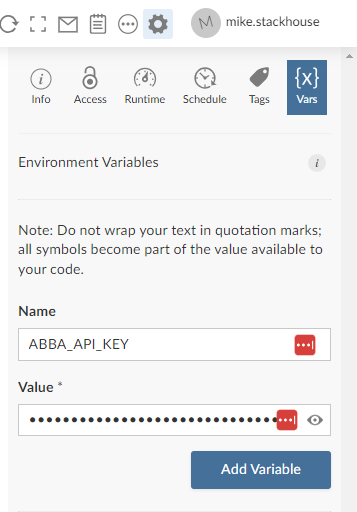
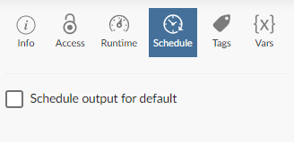
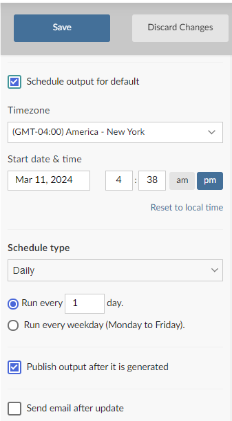

# Kubernetes Batch Jobs

``` r
library(abba)
```

If you’re an end user simply trying to run your work using **abba**,
then this vignette is for you.

Our ultimate goal with **abba** is to make it as simple as possible for
a user to user to do what they need to do. In doing so, there are a
handful of methods to interact with the **abba** API. These methods do
the work of submitting a job, waiting for it to complete, and collecting
the log output.

## End User Facing Functions

The **abba** end user methods all follow the naming convention `abba_`.

| **Function**                                                           | **Description**                                                               |
|------------------------------------------------------------------------|-------------------------------------------------------------------------------|
| [`abba_submit_job()`](../reference/abba_submit_job.md)                 | Submit a job to the **abba** API                                              |
| [`abba_submit_and_get_log()`](../reference/abba_submit_and_get_log.md) | Submit a job to the **abba** API, wait for completion, and return the job log |
| [`abba_wait_for_job_log()`](../reference/abba_wait_for_job_log.md)     | Continue polling until the job log is available                               |
| [`abba_get_job_log()`](../reference/abba_get_job_log.md)               | Retrieve a job log                                                            |
| [`abba_get_job_status()`](../reference/abba_get_job_status.md)         | Retrieve a job status                                                         |

As a user, this gives you some distinct control over your own workflow -
whether you want to submit the job and handle it later with some of the
other specific methods, or simply submit the job and hold the console
until the job completes. The internals of each of these methods handle
interaction with the API to ensure that HTTP requests don’t time out.
**Note the the methods do have their own configurable timeout limit.**.

## Create a Scheduled Batch File

A key reason that we created **abba** was to allow users to take
advantage of submitting jobs through Connect. A key benefit of this is
Connect’s ability to run reports on a set schedule, be it nightly or at
whatever interval you need. **abba** leverages this capability and
provides the extra component of sending your work out to a designated
environment. We do this by using R Markdown reports, for which Connect
has that scheduling capability.

Batch files can be created using the function
[`create_batch_job()`](../reference/create_batch.md).

``` r
create_batch_job("path/to/job_directory")
# Job file created at path/to/job_directory/job.Rmd
```

This creates a template R Markdown file with an example call to **abba**
ready to go.

``` r
abba::abba_submit_and_get_log(
  "/path/to/file.R",
  container = "<container_image_name>"
  )
```

There are some considerations for you should make when in your job
submission:

- The file path must be visible to you as a user.
- Make sure the job has enough resources to execute by using the
  `cpu_limit` and `memory_limit` arguments. Memory limits should be
  specified in Megabyte, so for example, a 4GB session would be listed
  as `'4000M'`.
- The timeout limits defaults to 10 minutes. If your job will likely run
  longer than 10 minutes, increase this using the `timeout_seconds`
  argument.
- Make sure you specify the appropriate container. This should likely
  match whatever you’re already using within Posit Workbench.

A user’s home directory is mounted to the container automatically, but
if you’re referencing data outside of your home directory then you may
have to add that path to the `mount` parameter. This needs to follow a
specific structure to tell the container how the drive should be
mounted. For example:

``` r
list(
  volumes=list(
    list(name='mount1', nfs=list(
      server='0.0.0.0',
      path='/mnt/remote/mount1')
      )
    ),
  volumeMounts=list(
    list(name='mount1', mountPath='/mnt/local/mount1')
    )
  )
)
```

In this example, the `volumes` element references the physical server
that needs to be mounted, and the targeted folder from the server that
is being mounted. The `volumeMounts` element indicates the path that
will be present locally within the container session. This example
represents a standard NFS mount. More complex mount types, such as SMB,
are not supported at this time.

### Deployment Prep

Before you deploy to connect, you’ll need to make sure that you have a
Posit Connect API key. Note that you’ll need at least a role of
Publisher to do this (and to actually deploy to Connect itself). You can
do this by following the instructions in the Posit Connect
documentation.

With that in place, make sure you test our your job locally before
deploying to connect. To do this, you’ll need the **abba** API URL
hosted in your environment, which you can get from your Posit support
team (or by looking through content visible to you on Posit Connect).

To test the job, we recommend setting two environment variables, as
you’ll be configuring these once deployed to connect:

- `ABBA_API_ADDRESS`, set to the URL of the **abba** API in your
  environment
- `ABBA_API_KEY`, set to the key you retrieved from Posit Connect. Make
  sure you keep this key secure.

You can set these locally as follows:

``` r
Sys.setenv(
  ABBA_API_ADDRESS = "https://your-connect-server.com/abba_apo",
  ABBA_API_KEY = "<your API key>"
)
```

Once set, knit the R Markdown file to make sure it executes.

### Deploy a Batch File to Connect

Now you can deploy your job to Posit Connect. This can be done following
a standard R Markdown deployment process, either using the [publish
button within the RStudio
IDE](https://docs.posit.co/connect/how-to/publish-r-markdown/), or using
[git backed content](https://docs.posit.co/connect/user/git-backed/) if
you’d like to follow a more controlled deployment process.

Once the Markdown file is in connect, you’ll need to set the environment
variables we specified above within the deployed environment.

 Once you the
environment variables are configured, you can hit the refresh button
(visible in the screenshot above) to rerun the Markdown job and make
sure it works.

### Schedule Your Cron Job

Once your job is executing successfully, you can configure the run
schedule. To do this, go to the Schedule tab of the deployed Markdown
file on Connect.



Schedule Panel

Click the “Schedule output for default” box and then fill out the rest
of the form:



Schedule Panel Options
