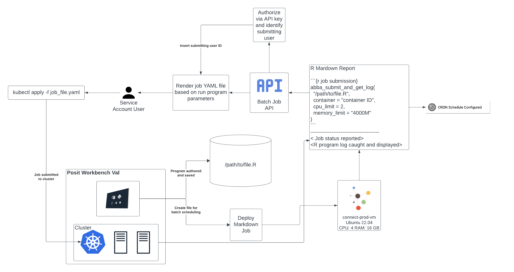
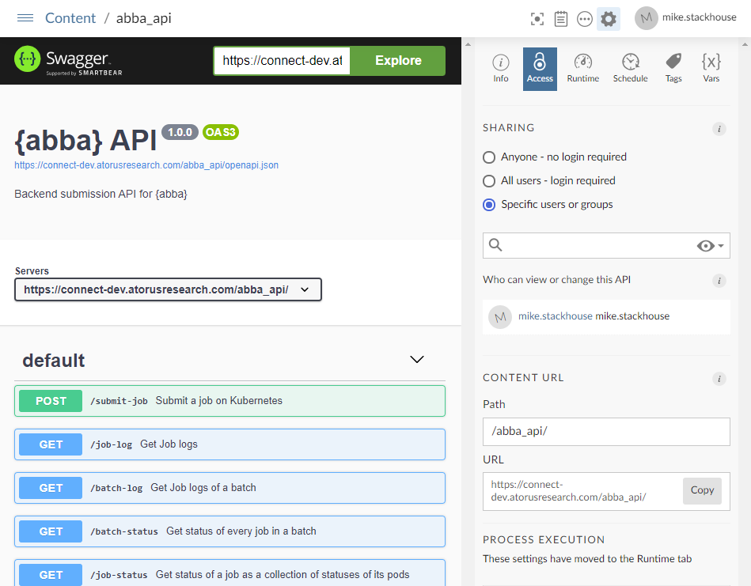
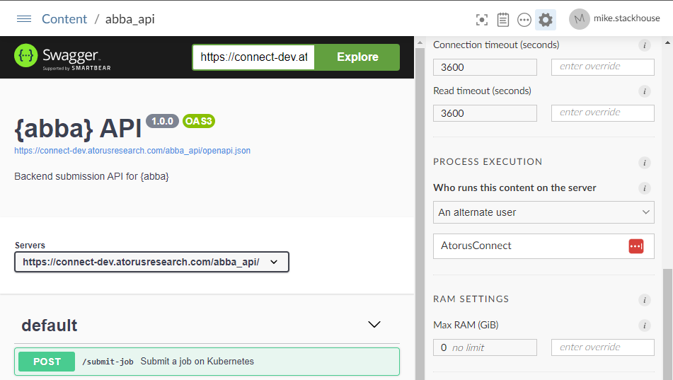
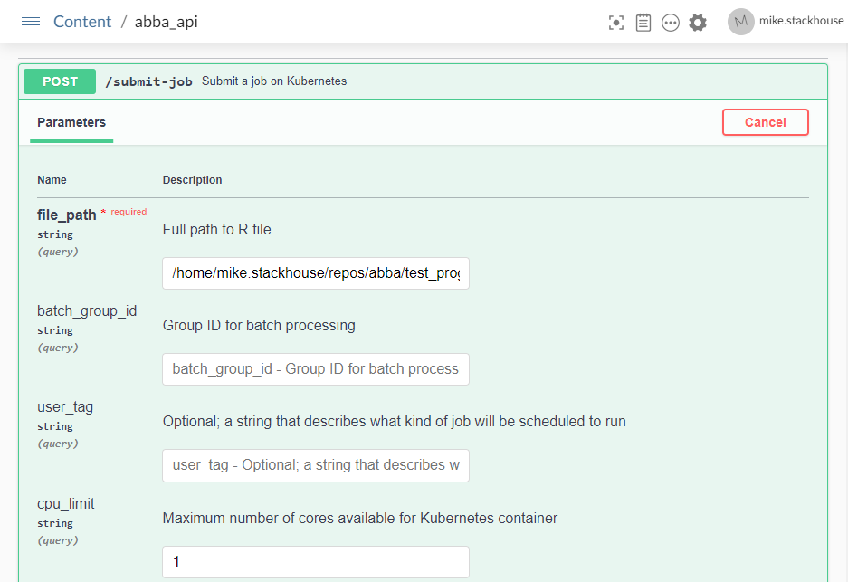
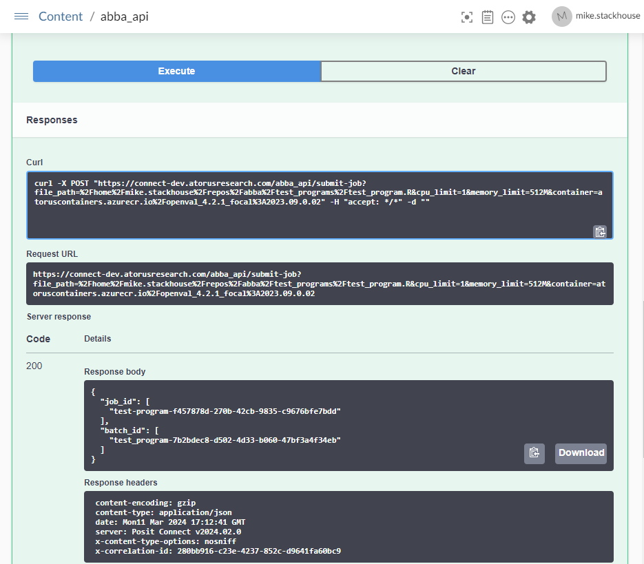

```{r, include = FALSE}
knitr::opts_chunk$set(
  collapse = TRUE,
  comment = "#>"
)
```

```{r setup}
library(abba)
```

# Introduction

To help manage important security considerations of working with Kubernetes, **abba** separates a users request to execute a job and the physical submission of that job to Kubernetes through an **abba**, which **abba** also lets you create. The instructions in this vignette will be specific to Posit Connect.

# {abba} Design

The general design of how *abba** interacts with Kubernetes looks like this.



# Prerequisites

In setting up the **abba** API, the Kubernetes command line too [kubectl](https://kubernetes.io/docs/reference/kubectl/) must be configured on the hosting system. There are some important considerations to this:

- The executing user account with `kubectl` configured has adminstrative control over the Kubernetes cluster. This gives it the ability to assume the identity of any designated user within a container session running from Kubernetes.
- When hosting in Posit Connect, `kubectl` should **not** be configured for the default `rstudio-connect` user account, as this would give any user running a job within Posit Connect the ability to utilize kubectl.
- A service account should be provisioned on the Posit Connect server, and kubectl should configured for this service account. 

# Create the API

With these pre-requisites in place, the API can be deployed. **abba** has the convenience function `create_batch_api()` for this purpose.

```{r create_api, eval=FALSE}
create_batch_api()
# Batch API file created at ./plumber.R
```

Once this is done, the options within the API file should be set according to your desired configuration and the resources available in your cluster:

```{r options, eval=FALSE}
options(
  abba.lower.cpu.limit=0.5,
  abba.cpu.limit = 2,
  abba.lower.memory.limit='128M',
  abba.memory.limit='1G',
  abba.permitted.containers = c("registry.com/openval_4.2.1_focal:2023.09.0.02",
                                "registry.com/openval_4.2.1_focal:latest",
                                "registry.com/openval_base_4.3.2_focal:2024.03.01",
                                "registry.com/openval_base_4.3.2_focal:latest",
                                "registry.com/openval-dev-focal:latest"),
  abba.default.container = "registry.com/openval_4.2.1_focal:2023.09.0.02"
  )
```

For more information about options, refer to `vignettes('abba_options')`

# Deploy the API

Once the API is configured, deploy it to Posit Connect. This can be done following a standard Plumber API deployment process, either using the [publish button within the RStudio IDE](https://docs.posit.co/how-to-guides/rsc/publish-plumberapi/#step-2-publish-your-plumber-api-to-rstudio-connect), or using [git backed content](https://docs.posit.co/connect/user/git-backed/) if you'd like to follow a more controlled deployment process. 

# Connect Setup

Once in Connect, it's important to change some specific settings. 

## API Access

On the content page for the deployed API, under the "Access" tab, make sure that access is limited to Specific users or groups. While here, you can also set a vanity URL to make the API web address easier to reference.



If there will be a large number of users who need to access the API, we recommend creating a user group specific for the API access. By limiting the API access, only permitted and authenticated users can send work to the API.

## API Runtime

_Note: This step must be performed by a Posit Connect adminstrator_

The second step is to set the runtime of the process execution to the appropriate user account. To do this, navigate to the "Runtime" tab of the content on Connect. Under "Process Execution", click the dropdown and specify "An alternate user". In the username field enter the username of the service account specified in the prerequisites section. 



# Test it Out

Once this is complete, you can test the API through the Swagger UI. Under the first API POST endpoint /submit-job, you can click "Try it out" and enter the path to an available R program for your user account. Note that for this to work, you should be a Posit Workbench user, and have access to the program that you're trying to execute. 



Once you fill out the appropriate fields, click "Execute". If it worked, in the boxes below you will see that you had a success 200 response and be able to view the response body.




